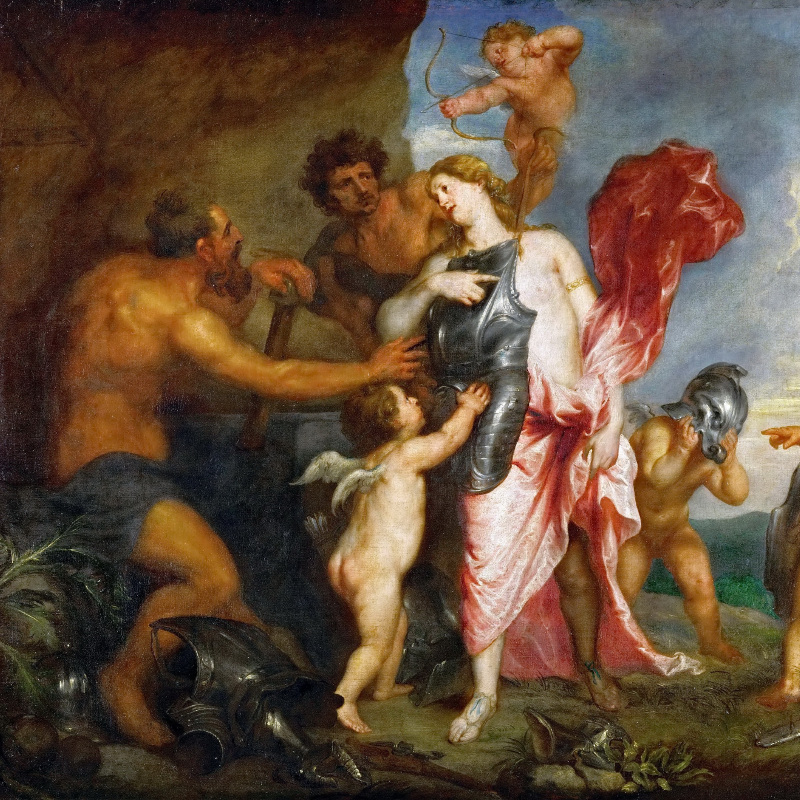
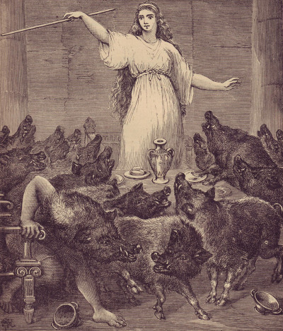
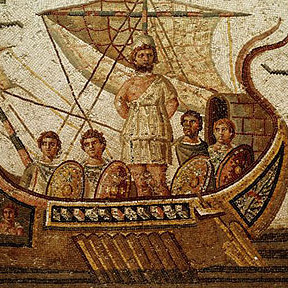

I've been trying to pack everything I do into a set of libraries which eventually serve me as frameworks to new projects. Some day, they will get documented so people might find some use. Here is the list of what I have so far :

  

    

      <article class="archive__item" itemscope itemtype="http://schema.org/CreativeWork">
        

           
        

        <h2 class="archive__item-title" itemprop="headline">Ponos</h2>
        

      <strong>Utility Library</strong>
        

        

      Data structures, geometry and other useful tools.
        

      </article>
    

    

      <article class="archive__item" itemscope itemtype="http://schema.org/CreativeWork">
        

           
        

        <h2 class="archive__item-title" itemprop="headline">Circe</h2>
        

  <strong>Graphics Engine</strong>
        

        

  Intended to be a minimalist framework for the development of applications based on OpenGL.
        

      </article>
    

  

      <article class="archive__item" itemscope itemtype="http://schema.org/CreativeWork">
        

           
        

        <h2 class="archive__item-title" itemprop="headline">Poseidon</h2>
        

  <strong>Physically Based Simulation Engine</strong>
        

        

  Set of algorithms and data structures for implementing fluid simulations in C&#43;&#43;.
        

      </article>
    

  

      <article class="archive__item" itemscope itemtype="http://schema.org/CreativeWork">
        

           
        

        <h2 class="archive__item-title" itemprop="headline">Helios</h2>
        

    <strong>Renderer</strong>
        

        

    Physically based renderer strongly based on pbrt book.
        

      </article>
    

      <article class="archive__item" itemscope itemtype="http://schema.org/CreativeWork">
        

           
        

        <h2 class="archive__item-title" itemprop="headline">Odysseus</h2>
        

      <strong>Game engine</strong>
        

        

      Game engine for C++
        

      </article>
    

      <article class="archive__item" itemscope itemtype="http://schema.org/CreativeWork">
        

           
        

        <h2 class="archive__item-title" itemprop="headline">Heracles</h2>
        

    <strong>Physics Engine</strong>
        

        

    Physics engine and set of functions for collision detection.
        

      </article>
    

  

