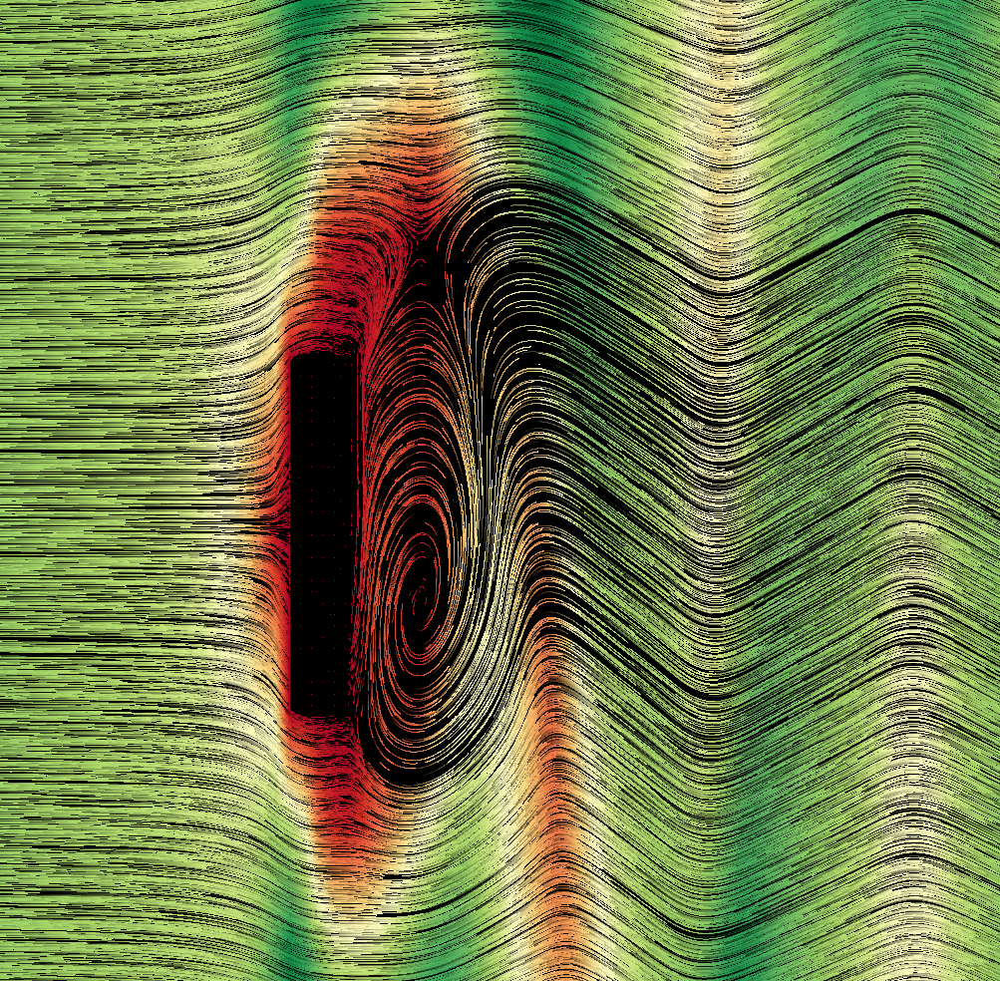
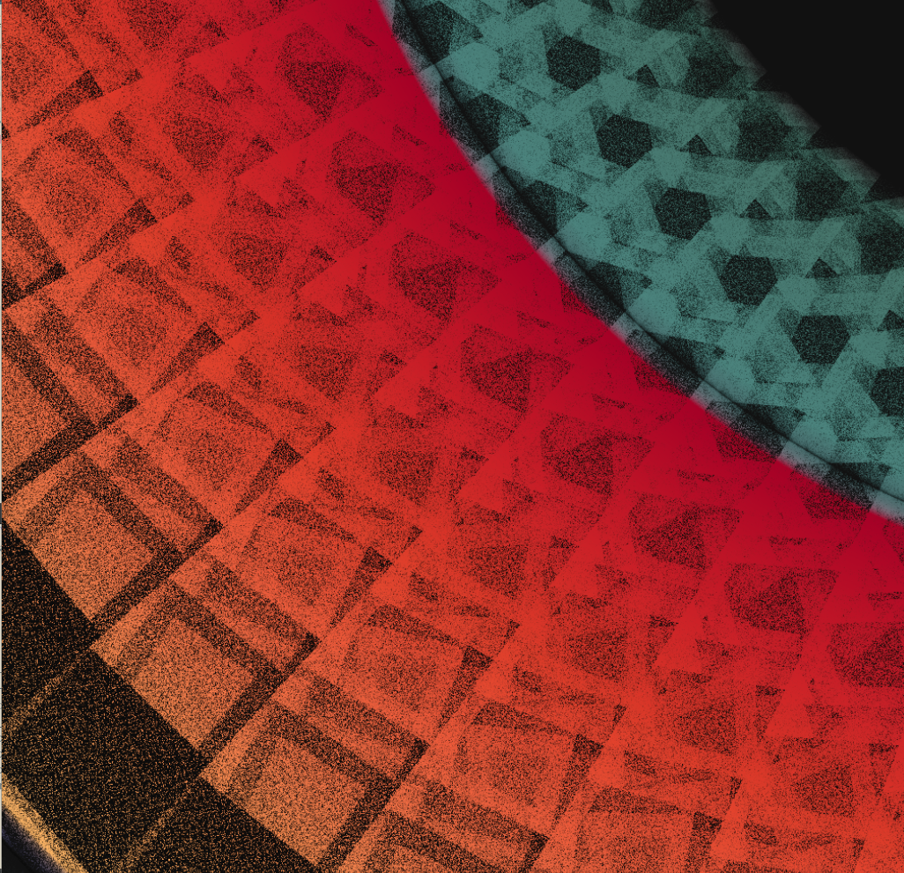

Programming can be quite frustrating sometimes (if not most of the time), as we spend a great deal of time fixing errors and solving bugs. In graphics programming, bugs usually manifest visually and end up producing fun images of our struggle.

Here is a list of some of my numerous frustrating surprises that I certainly would not be able to reproduce consciously.

## Streamlines
Streamlines provide a cool way to visualize velocity fields and follow a simple idea: inject particles in the flow and track their path using line segments as time advances. When your code works you get something like:

 

 
A quick way to produce this type of visualization is to use shaders and textures: Keep a buffer storing particle positions and lifetimes. In each iteration, update particle positions and render them on top of your previous render applied with an alpha factor. As particles move in time, their old are still visible, drawing a streamline. Well, at some point my buggy shaders gave me this cool visual:

 

